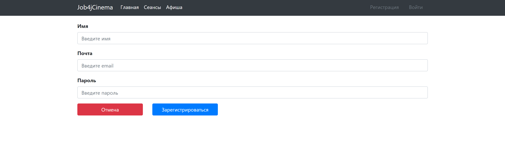
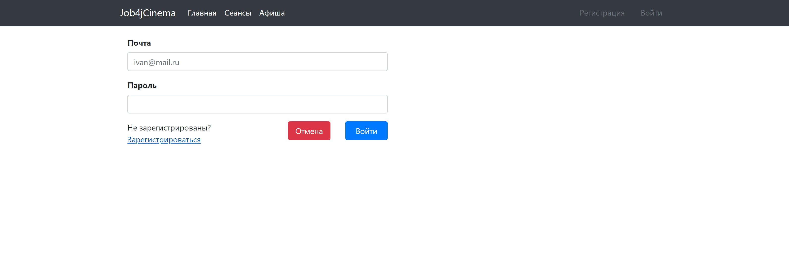
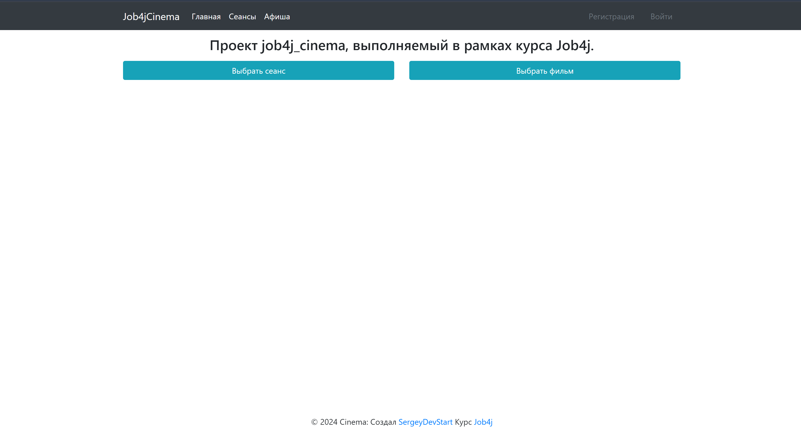
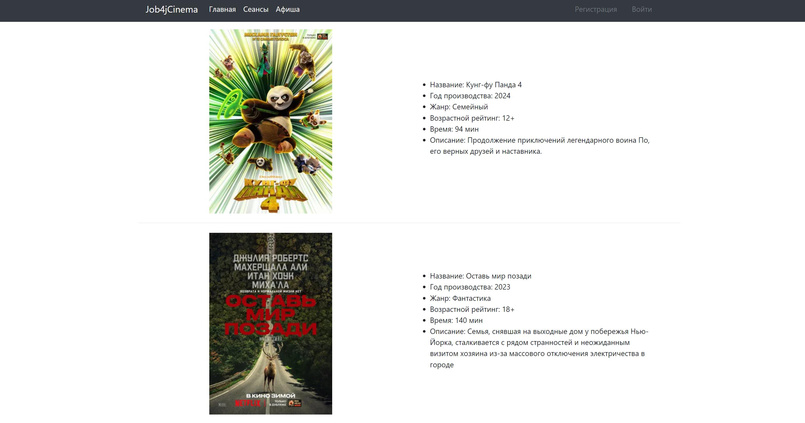
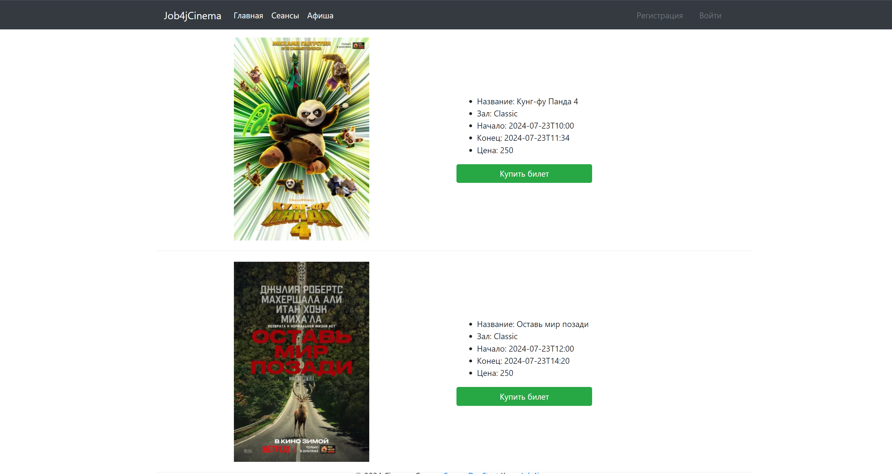
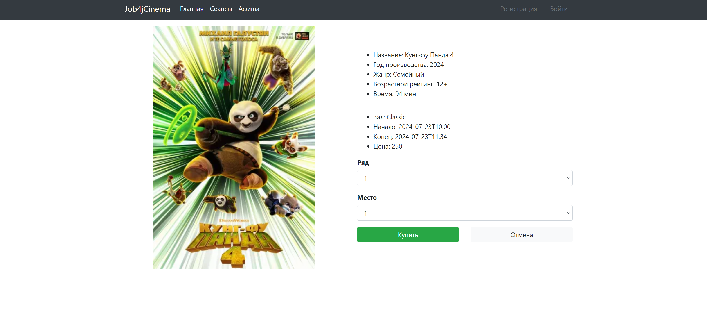

# job4j_cinema

## Описание проекта

job4j_cinema - сервис по покупке билетов в кинотеатр.
Сервис позволяет:
1. Зарегистрировать нового пользователя или войти в систему при наличии аккаунта.
2. Посмотреть информацию о киносеансах и фильмах
3. Купить билет.

Данные сохраняются в БД.

### Технологии используемые в проекте:
- Spring boot 2.7.6
- Tomcat
- Thymeleaf
- Bootstrap
- Liquibase
- PostgreSQL 42.5.1
- h2database 2.1.214
- Sql2o 1.6.0
- commons-dbcp2 2.9.0
- Junit
- AssertJ
- Mockito
- SLF4J

### Требования к окружению:
- Java 17
- Maven 3.9.3
- PostgreSQL 14

## Запуск проекта:
1. Создайте базу данных PostgreSQL:
    ```sql
    CREATE DATABASE cinema_db;
    ```
2. Склонируйте репозиторий:
    ```bash
    git clone https://github.com/SergeyDevStart/job4j_cinema
    cd job4j_cinema
    ```

3. Соберите проект с помощью Maven:
    ```bash
    mvn clean install
    ```

4. Запустите приложение:
    ```bash
    mvn spring-boot:run
    ```

После успешного запуска приложение будет доступно по адресу: [http://localhost:8080](http://localhost:8080)

## Взаимодействие с приложением:

#### Регистрация/вход



#### Главная страница


#### Список фильмов


#### Сеансы


#### Страница покупки билета


#### Удачная/неудачная покупка билета


## Контакты
